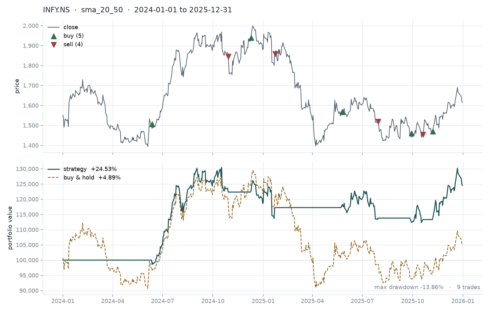

# paper-trader

A market data pipeline and backtesting engine, in Python. Ingests daily
bars, stores them, runs a strategy over them, and reports what would have
happened.

**Paper only.** It never places a real order and has no broker
credentials anywhere in it. It moves numbers in a SQLite file.

I built this because I wanted to understand the engineering problems
underneath trading systems rather than the trading itself. Most of the
interesting work turned out to have nothing to do with strategies.

## Running it

```bash
python3 -m venv .venv && source .venv/bin/activate
pip install -r requirements.txt

# Fetch some data
python -m paper_trader.cli ingest AAPL --start 2024-01-01 --end 2025-12-31

# Backtest a 20/50 moving average crossover over it
python -m paper_trader.cli backtest AAPL --start 2024-01-01 --end 2025-12-31

# ...and draw it
python -m paper_trader.cli backtest AAPL --start 2024-01-01 --end 2025-12-31 --plot chart.png
```



Top panel is price with the actual fills marked. Bottom is strategy
equity against buy-and-hold, which is the only comparison that means
anything -- 24.53% looks good until you ask what the stock did, and it
looks better once you find out it did 4.89%.

NSE symbols work too, with the Yahoo suffix: `RELIANCE.NS`, `INFY.NS`.

With realistic costs, and an HTML report with the trade table:

```bash
python -m paper_trader.cli backtest INFY.NS --start 2024-01-01 --end 2025-12-31 \
    --commission 0.03 --slippage 0.05 --report report.html
```

```bash
PYTHONPATH=src python -m pytest      # 49 tests
```

## How it fits together

```
datasource/  fetch bars from somewhere, validate at the boundary
storage/     SQLite store with idempotent writes and gap detection
strategy/    signal generation, no lookahead
backtest/    walk bars forward, fill orders, track equity
portfolio.py simulated cash and positions, reconciled against a fill log
```

`ingest` and `backtest` are deliberately separate commands. Fetching is
slow, rate limited and fails; backtesting should be instant and
repeatable. Splitting them means I can change a strategy fifty times
without touching the network.

## Three things I got wrong first

**Filling at the wrong price.** My first backtester generated a signal
from a bar's close and filled the order at that same close. That silently
assumes you can trade at a price you only knew at the end of the day, and
it made a mediocre strategy look good. Orders now fill at the *next*
bar's open. There's a test for it, because the bug is invisible in the
output.

**Re-ingesting duplicated bars.** Fetching an overlapping date range
appended rows instead of replacing them, so bars got counted twice and
every downstream number was wrong. The fix is a primary key on
`(symbol, day)` and `INSERT ... ON CONFLICT DO UPDATE`. This is the same
problem as not double-posting a payment, which I hadn't expected to run
into in a hobby project.

**Trusting the upstream data.** yfinance returns NaN rows, and its column
shape changes between versions and between single and multi-symbol
requests. Bars are now validated where they enter the system: high can't
be below low, close has to sit inside the day's range, volume can't be
negative. Bad rows are skipped rather than imputed, because inventing a
price is worse than having a gap.

## Reconciliation

Cash and positions are derived state. The fill log is the source of
truth. `Portfolio.reconcile()` recomputes both from the log and raises if
they disagree, and the backtest engine calls it before producing a
report.

I added it after a bug where a code path updated cash but not the
position. The numbers looked plausible, which was the problem.

## Built with

The initial scaffold -- interfaces, SQLite schema, backtest engine and
the first 36 tests -- was written with **Claude Code**, working from a
design I'd specified: separate ingest from backtest, idempotent writes,
fill at next open, reconcile against a fill log.

Everything after the first commit is in the git history, and I'll note
here what each tool was actually used for as I go rather than listing
them up front.

The division of labour that's working so far: models are fast on
structure, boilerplate and test scaffolding, and I stay slow and manual
on the parts where being wrong is invisible in the output. The next-open
fill rule and the reconciliation check are both cases where generated
code ran fine and was subtly wrong until I went back over it.

Rough rule: fast where being wrong is loud, slow where being wrong is
quiet.

## What transaction costs actually did

I assumed costs would change the ranking between parameter sets. At
Indian discount-broker rates they don't, and measuring was the only way
to find that out.

INFY.NS, 2024-01-01 to 2025-12-31, at 0.03% commission per side plus
0.05% slippage:

| windows | free    | with costs | trades |
|---------|---------|------------|--------|
| 5/20    | -9.99%  | -11.90%    | 29     |
| 10/30   | 26.43%  | 25.07%     | 13     |
| 20/50   | 24.53%  | 23.64%     | 9      |
| 50/200  | -3.75%  | -3.83%     | 1      |

Costs scale cleanly with turnover, roughly 0.07 percentage points per
trade, and the ordering is unchanged. This strategy simply doesn't trade
often enough for discount-broker fees to decide anything.

Push the rates up to 0.3% commission and 0.2% slippage, which is a
full-service broker or an illiquid stock, and it does matter: 5/20 goes
from -9.99% to -21.86%, and 20/50 overtakes 10/30. The ranking flips.
So cost sensitivity is a function of turnover, and which parameter set
looks best depends on the fee regime you assume.

Commission is recorded on the `Fill` rather than deducted straight from
cash, so `reconcile()` still balances. There's a test that fails if you
take the shortcut.

## Not done yet

- Exchange calendar, so holiday gaps stop being reported as suspicious
- Position sizing beyond all-in / all-out on one symbol
- A broker data source behind the same `DataSource` interface
- Sharpe and per-trade statistics in the report
